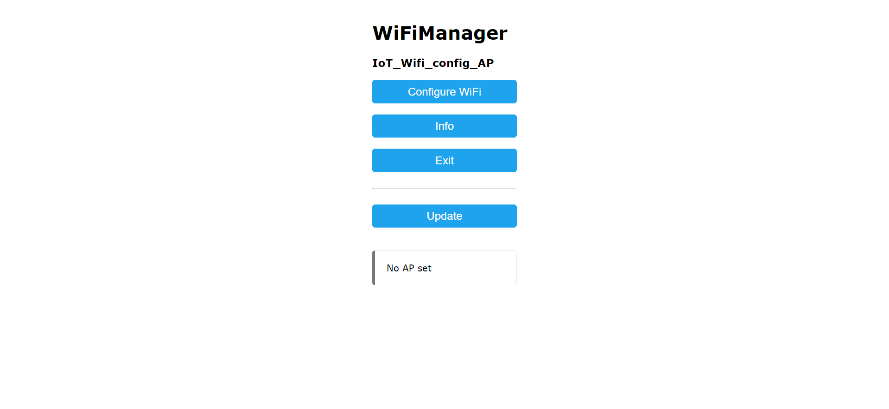
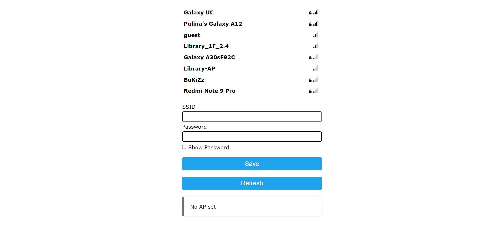

## IoT_Edge_Device-ESP32_WiFi

ESP32 WiFi device as a edged IoT device. Accessible via WebAPI

On running, device creates a open WiFi Access Point(AP) named `IoT_Wifi_config_AP` which can be used to configure WiFi credentials of your network router.Web UI for network configuration is accessible in http://192.168.4.1.

- Wifi Manager Homepage

  - Go to `http://192.168.4.1`

    

  - Go to Configure Wifi

    

`When connecting to network, the ip assisgned to controller should be found in order to call API endpoints`

Assuming the device ip was `192.168.a.b` - should found on connecting UI

Then:

- Once the device is connected to your network, the device is accessible by the WebAPI in the device IP.

- Two controller functions
  - Temperature Sensor
    - The DHT11 Temp & Humidity Sensor Module's out should be connected to `GPIO4` pin.
  - LED read & write
    - Build in LED is used (PIN 2)

### API

- Data fetching endpoints

  - `POST` request to endpoint: `http://192.168.a.b/fetch` with JSON body

    ```json
    {
    	"parameter": "led"
    }
    ```

    Here the `parameter` could be one of:

    - `temp`
    - `led`

    based on the data need to be fetched.

  - Response will be: 200

    ```json
    {
    	"parameter": "temp",
    	"value": 32.40000153
    }
    ```

---

- Updating endpoints

  - `POST` request to endpoint: `http://192.168.a.b/update` with JSON body

    ```json
    {
    	"parameter": "led",
    	"value": "on"
    }
    ```

    Here the `parameter` could be:

    - `led`

    and the `value` could be one of:

    - `on`
    - `off`

  - Response will be: 200

  ```json
  LED turned ON
  ```
